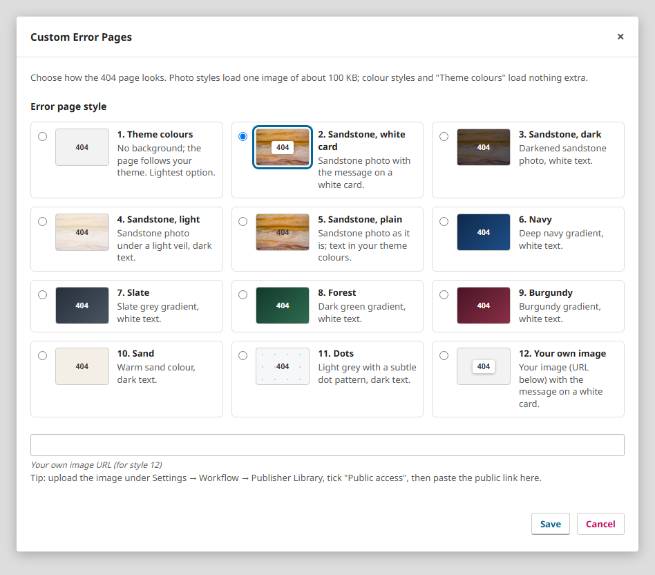
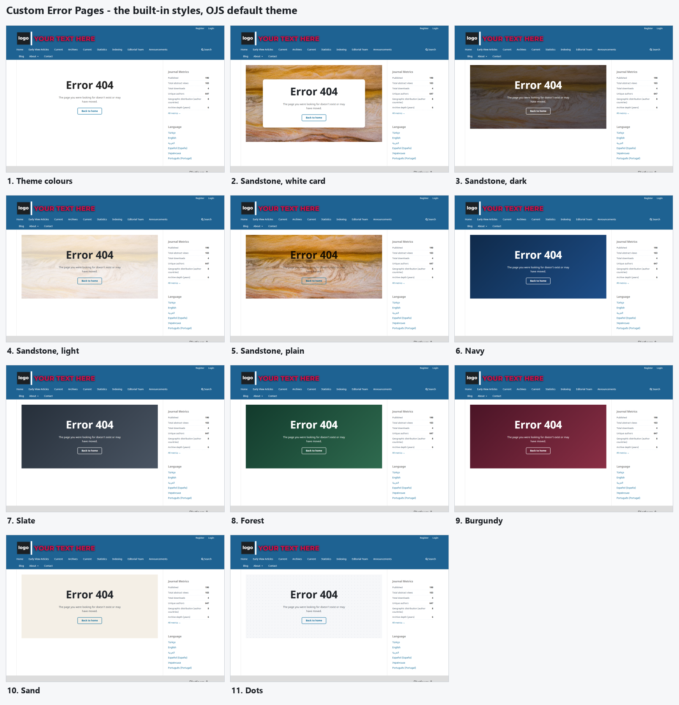
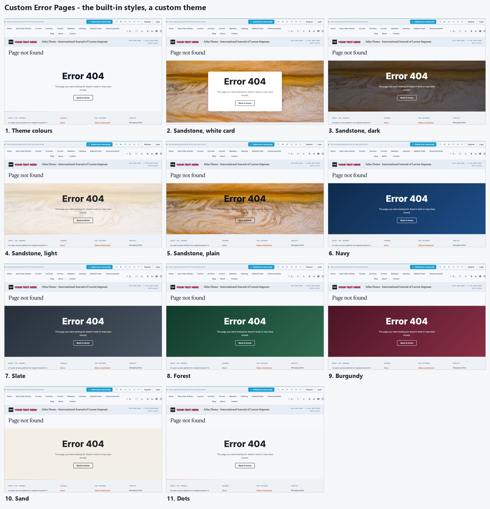

# Custom Error Pages

A plugin for **OJS 3.3** that replaces OJS' bare `404 Not Found` message with a friendly error page in your journal's own theme, with its header, footer and menu. It works with any theme and needs no changes to OJS.

The themed page is shown for unknown pages, deleted articles, missing issues, unknown journal paths and missing files. For a missing file, it links back to the article or issue.

## Choose a style

Each journal picks how its error page looks from a list of 12 styles in the plugin settings:

Photo styles load one small image (about 100 KB); the colour styles load nothing extra. With *Your own image* (style 12) you can use any image, for example one uploaded to *Settings → Workflow → Publisher Library* with *Public access* ticked.

### Examples

The styles in OJS' default theme:

The same styles in a custom theme:

## Installation

1. Download `customErrorPages-ojs3.3-<version>.tar.gz` from [Releases](../../releases). (For OJS 3.4 and 3.5, use the `-ojs3.4-` or `-ojs3.5-` package of the same version.)
2. In OJS, go to *Settings → Website → Plugins → Upload a new plugin* and choose the file.
3. Enable **Custom Error Pages** in each journal where you want it.
4. Optional: open *Custom Error Pages → Settings* and pick a style.

**Upgrading from 1.4.0.0 or older:** delete the old plugin in the plugin list first, then upload the new package. Your settings are kept (except from 1.1.x, which used a different plugin name).

## Requirements

- OJS 3.3.0-x
- PHP 7.3 or later

## Licence

GNU General Public License v3. See [LICENSE](LICENSE).

© OJS Services — info@ojs-services.com
